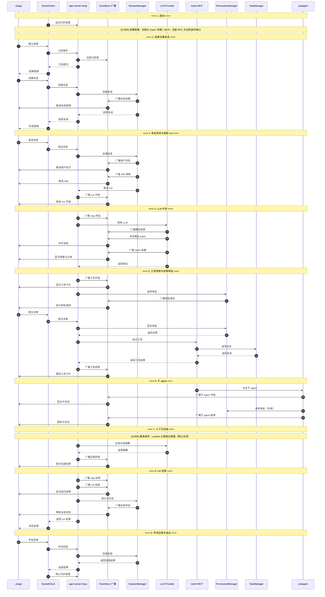

# zhuo_agent

本地 AI Agent 系统。`zhuo-core` 作为常驻守护进程处理所有任务，`zhuo`（CLI）和 `zhuo-tui`（TUI）通过 TCP loopback 与之通信。

## 环境要求

| 依赖 | 版本 |
|------|------|
| 操作系统 | macOS / Linux |
| Python | 3.12.x |
| [uv](https://docs.astral.sh/uv/) | ≥ 0.4 |

安装 uv（若尚未安装）：

```bash
curl -LsSf https://astral.sh/uv/install.sh | sh
```

Python 3.12 由 uv 自动管理，无需手动安装。

## 快速开始

```bash
git clone <repo> && cd zhuo_agent
uv sync

uv run zhuo-core            # 启动守护进程
uv run zhuo ping            # 验证连通：应返回 pong
uv run zhuo --version       # 应输出 0.0.1
```

## 运行时序

`zhuo-core` 是常驻守护进程，`zhuo`（CLI）与 `zhuo-tui`（TUI）作为前端，通过 loopback 上
换行分隔的 JSON-RPC 2.0（NDJSON）与它通信。下图只表达大模块之间的调用关系，不展开报文
内容与状态细节：启动 → 建会话 → 装配一轮 run → LLM 步进 → 工具调用与权限审批 →
子 agent → 上下文压缩 → 收尾与退出。

只画 10 个大模块；`Compactor`、`TraceWriter`、`SessionStore`、`memory loader` 等内部件
折叠进 `CORE` / `SESS` 的说明行里。


### 时序图（Mermaid）




## Skills / Subagents / MCP

TUI 里输入 `/` 会弹出 skill 补全框（↑↓ 选择、Tab/Enter 确认、Esc 收起）。内建 skill：
`/orchestrate`（planner→executor→reviewer 三阶段多 agent 工作流）、`/review`、`/summarize`、`/init`。

覆盖优先级：项目本地 `<PROJECT_ROOT>/.zhuo/skills/*.md` > 用户全局 `~/.zhuo/skills/*.md` > 内建。
Agent 角色配置同理（`<PROJECT_ROOT>/.zhuo/agents/*.toml` > `~/.zhuo/agents/*.toml` > 内建
planner / executor / reviewer）。

MCP server 在 `config.toml`（默认 `<PROJECT_ROOT>/config.toml`）中声明，工具以 `{server}__{tool}`
命名注册（首次调用会像其他工具一样请求审批）：

```toml
[[mcp.servers]]
name = "filesystem"
transport = "stdio"          # "stdio" | "tcp"
command = "npx"
args = ["-y", "@modelcontextprotocol/server-filesystem", "/tmp"]

[[mcp.servers]]
name = "remote"
transport = "tcp"
host = "127.0.0.1"
port = 4010
```

## 验证

```bash
uv run ruff check src    # 风格与 import 排序
uv run mypy src          # 严格类型检查
uv run zhuo-tui          # 手工验收：输入 / 看补全框，/orchestrate <目标> 看子 agent 树
```

前两条等价于 `make lint`；`make` 里还有 `run` / `ping` / `chat` / `test` / `tui` /
`trace` / `replay` / `clean` 等目标，`zhuo` 的完整子命令见 `uv run zhuo --help`。
